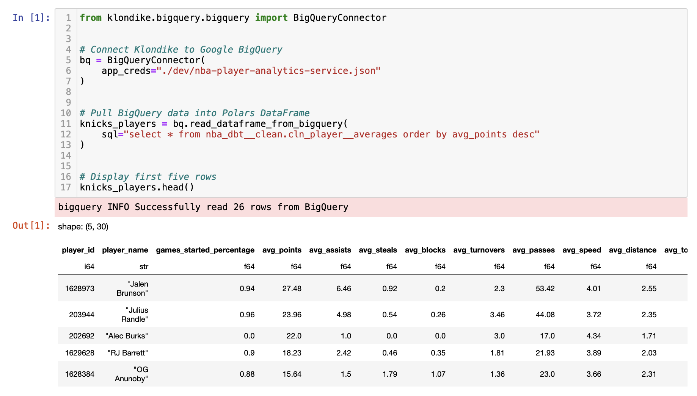
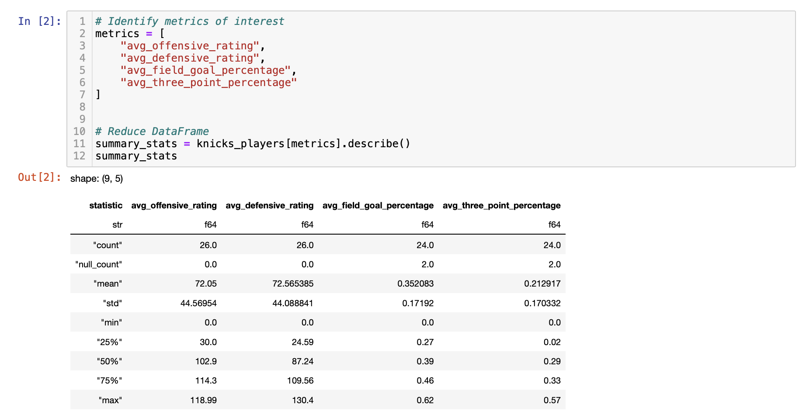
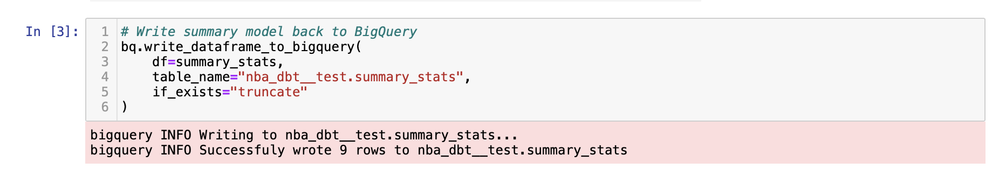

# Klondike


Klondike offers a lightweight API to read and write data to Google BigQuery using Polars DataFrames.

## Installation

### Installing Klondike
Install at the command line

```
pip install klondike==0.1.0
```

### Installing Rust
Since Polars leverages Rust speedups, you need to have Rust installed in your environment as well. See the Rust installation guide [here](https://www.rust-lang.org/tools/install).


## Usage

In this demo we'll connect to BigQuery, read data, transform it, and write it back to the data warehouse.

First, connect to the BigQuery warehouse by supplying the `BigQueryConnector()` object with the relative path to your service account credentials.

Next, supply the object with a SQL query in the `read_dataframe_from_bigquery()` function to redner a `DataFrame` object:

```
from klondike import BigQueryConnector

# Connect Klondike to Google BigQuery
bq = BigQueryConnector(
    app_creds="dev/nba-player-service.json"
)


# Write some valid SQL
sql = """
SELECT
    *
FROM nba_dbt.cln_player__averages
ORDER BY avg_points DESC
"""


# Pull BigQuery data into a Polars DataFrame
nyk = bq.read_dataframe_from_bigquery(sql=sql)
```



Now that your data is pulled into a local instance, you can clean and transform it using standard Polars functionality - [see the docs](https://docs.pola.rs/py-polars/html/reference/dataframe/index.html) for more information.



Finally, push your transformed data back to the BigQuery warehouse using the `write_dataframe_to_bigquery()` function:

